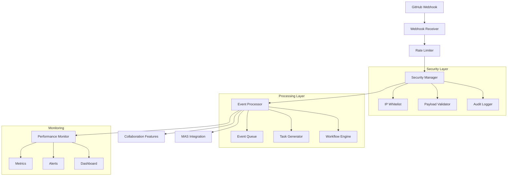

# GitBridge Webhook System Architecture

## System Overview

The GitBridge webhook system is a modular, scalable architecture designed to process GitHub events and integrate them with the MAS (Multi-Agent System) Lite Protocol v2.1. This document outlines the core components and their interactions.

## Component Architecture

## Component Details

### 1. Rate Limiter (`rate_limiter.py`)
- **Purpose**: Distributed rate limiting with Redis backend
- **Key Classes**: 
  - `RateLimiter`: Main rate limiting implementation
  - `RedisRateLimiter`: Redis-backed rate limiting
- **Dependencies**: Redis, `redis-py`
- **Integration**: Called by webhook receiver before processing

### 2. Security Manager (`security_manager.py`)
- **Purpose**: Request validation and security enforcement
- **Key Classes**:
  - `SecurityManager`: Main security orchestrator
  - `IPWhitelist`: GitHub IP validation
  - `PayloadValidator`: Webhook signature verification
- **Dependencies**: `cryptography`, `requests`
- **Integration**: Called after rate limiting, before event processing

### 3. Event Processor (`event_processor.py`)
- **Purpose**: GitHub event handling and routing
- **Key Classes**:
  - `EventProcessor`: Main event processing logic
  - `EventRouter`: Event type-based routing
  - `TaskGenerator`: MAS task creation
- **Dependencies**: `pydantic`, `asyncio`
- **Integration**: Core processing unit, interfaces with MAS

### 4. Performance Monitor (`performance_monitor.py`)
- **Purpose**: System metrics and alerting
- **Key Classes**:
  - `PerformanceMonitor`: Metrics collection
  - `AlertManager`: Alert generation
  - `MetricsExporter`: Prometheus integration
- **Dependencies**: `prometheus_client`, `grafana`
- **Integration**: Monitors all system components

### 5. Developer Tools (`dev_tools.py`)
- **Purpose**: Development and testing utilities
- **Key Classes**:
  - `WebhookTester`: Webhook simulation
  - `EventReplay`: Historical event replay
  - `ConfigValidator`: Configuration validation
- **Dependencies**: `pytest`, `requests-mock`
- **Integration**: Used in development environment

### 6. Collaboration Features (`collaboration.py`)
- **Purpose**: Team notification and approval flows
- **Key Classes**:
  - `NotificationManager`: Team alerts
  - `ApprovalWorkflow`: Review process
  - `DocumentationManager`: Auto-documentation
- **Dependencies**: `slack-sdk`, `jinja2`
- **Integration**: Called by event processor for team actions

## Event Flow Example

1. GitHub sends webhook to `/webhook` endpoint
2. Rate limiter checks request against limits
3. Security manager validates GitHub IP and signature
4. Event processor identifies event type and creates tasks
5. Performance monitor tracks processing time
6. Collaboration features notify relevant team members
7. MAS receives generated tasks for processing

## Error Handling

- All components implement robust error handling
- Failed events are logged and retried
- Critical errors trigger alerts
- Automatic fallback mechanisms for rate limiting

## Monitoring and Metrics

- Request latency
- Event processing time
- Error rates
- Queue depths
- System resource usage

## Security Considerations

- All GitHub IPs validated
- Webhook signatures verified
- Payload sanitization
- Audit logging
- Rate limiting per endpoint

## Future Extensibility

The system is designed for future expansion with:
- Pluggable notification backends
- Custom event processors
- Additional security layers
- Enhanced monitoring capabilities 